# Minfulness 4 All

Minfulness 4 All is a site to provide guidance to any user who wishes to enter the world of mindfulness. What is mindfulness, how to practice it and resources to achieve it.

Throughout the page, the user can use the videos and audios to discover and practice mindfulness.

## Existing Features

- __Navigation Bar__

  - Responsive navigation toggle bar to allow users to navigate through the different sections of the page.

 

- __Home__

  - Description of what Mindfulness is, as well as breath and chakras

  - At the bottom a section with some courses that the site offers to users. These courses will have a link to the contact page.
  

- __Learning__

  - Introduction to Meditation for beginner users. Each step to begin practicing meditation is explained on this page.

  - A sidebar with local links to redirect users to the different explanation paragraphs.

- __Practicing__

  - Different audio-guided meditations are offered to users here. Five simple meditation exercises selected for users to practice. More exercises can be added in the future

  - A sidebar with local links to redirect users to the different meditations.

#### Learning and Practicing have the same introductory structure, with a video and a paragraph showing information about mindfulness.

- __Contact__

  - A form for users to submit questions and sign up for the newsletter.
  
  - All internal links that cannot be redirected to a specific place are redirected here (e.g. the courses, because I have only created the links as a way of practicing, not the courses page itself).

## Features Left to Implement

  - About us page.
  
  - A page with the different meditation courses.

## Testing

### Validator Testing

#### HTML

- No errors were returned when passing through the official [W3C validator](https://validator.w3.org/nu/)

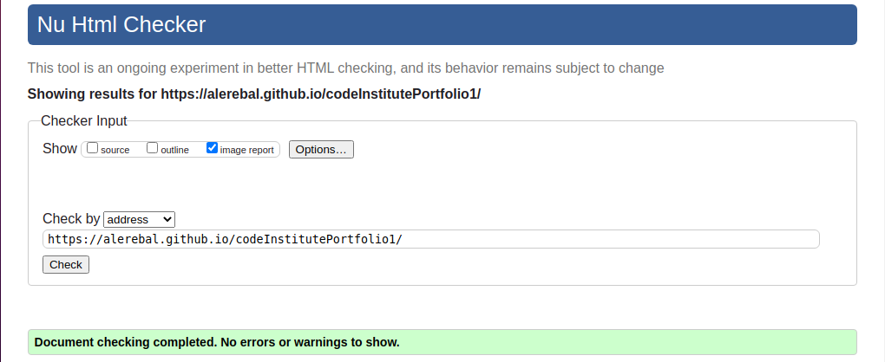

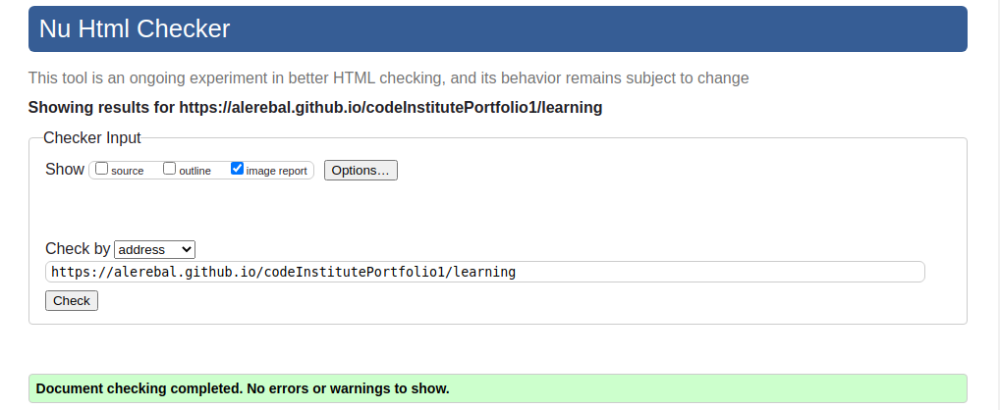

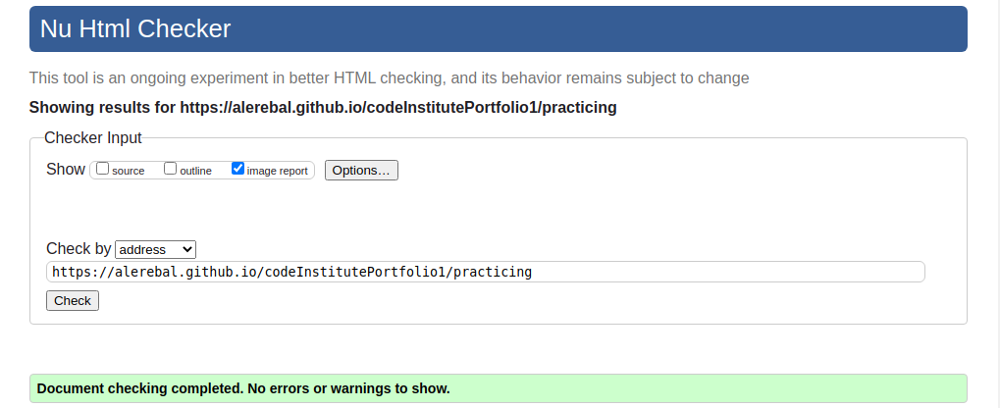

#### CSS

- No errors were found when passing through the official [(Jigsaw) validator](https://jigsaw.w3.org/css-validator)

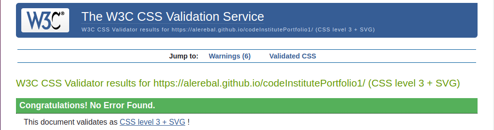
##### Gave me some warnings about variables
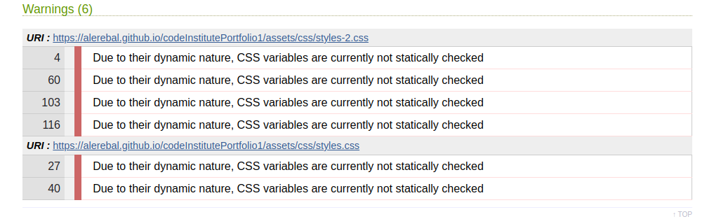
  

### Lighthouse Testing

#### Home

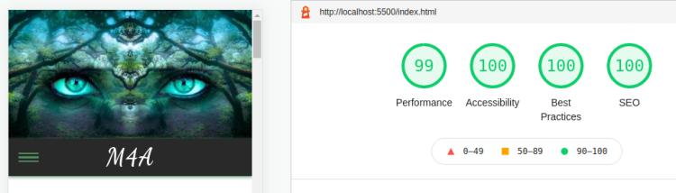

#### Learning

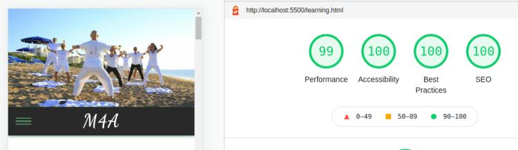

#### Practicing

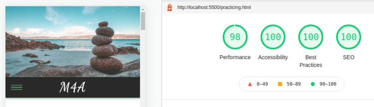

#### Contact

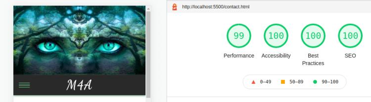

## Bugs

On the Learning and Practice pages, the main container and the footer were separated by a space. That did not happen in the Index and Contact pages.

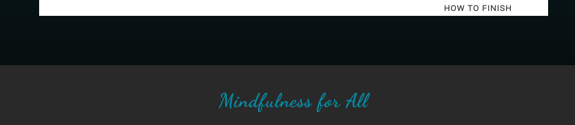

What I did was add a border to the main container on both pages to fix it:

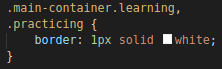

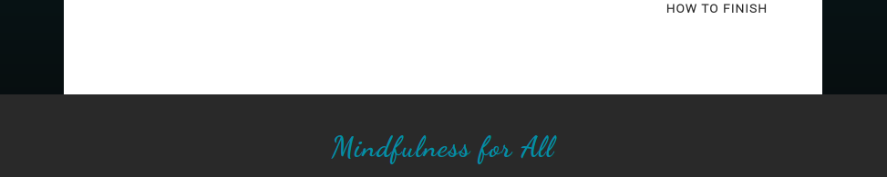

## Deployment

- This site has been deployed on GitHub pages by following these steps:
    - In the GitHub repository, navigate to the Settings tab and in the left menu select Pages.
    - From the source section drop-down menu, select the Master Branch.
    - Once the master branch has been selected, the page will be automatically refreshed with a detailed ribbon display to indicate the successful deployment.
    - A link to the newly created page will be displayed here.

Here you can see the page - https://alerebal.github.io/codeInstitutePortfolio1/index.html 

## Resources

### Content 

#### The text on the page was taken from

Verywell mind - https://www.verywellmind.com/mindfulness-meditation-88369

Every day healt - www.everydayhealth.com

Pure Wow - https://www.purewow.com/wellness/chakra-meditation

### Media

#### The images I am using are free to download and I got them from: 

Pixabay - https://pixabay.com

Unsplash - https://unsplash.com

#### The audios were taken from

HelpGuide - https://www.helpguide.org/

#### The videos were taken from

Pexel - https://www.pexels.com/

