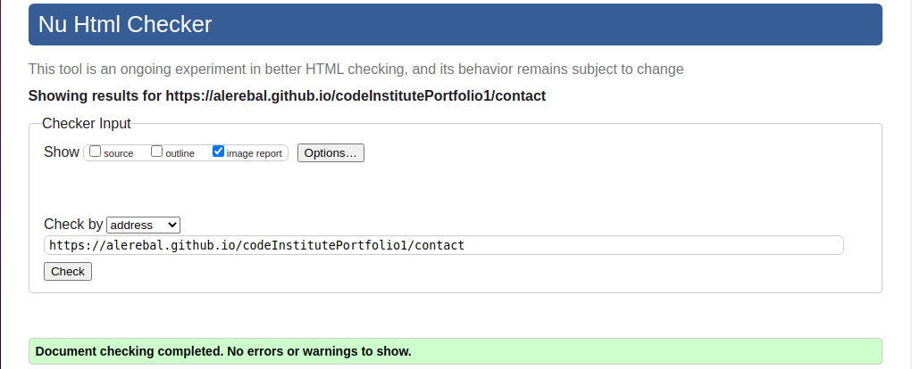

# Minfulness 4 All

Minfulness 4 All is a site to provide guidance to any user who wishes to enter the world of mindfulness. What is mindfulness, how to practice it and resources to achieve it.

Throughout the page, the user can use the videos and audios to discover and practice mindfulness.

## Existing Features

- __Navigation Bar__

- Responsive navigation toggle bar to allow users to navigate through the different sections of the page.

 

- __Home__

- Description of what Mindfulness is, as well as breath and chakras

- At the bottom a section with some courses that the site offers to users. These courses will have a link to the contact page.
  

- __Learning__

- Introduction to Meditation for beginner users.

- A sidebar with local links to redirect users to the different explanation paragraphs.

- __Practicing__

- Different audio-guided meditations are offered to users here.

- A sidebar with local links to redirect users to the different meditations.

#### Learning and Practicing have the same introductory structure, with a video and a paragraph showing information about mindfulness.

- __Contact__

- A form for users to submit questions and sign up for the newsletter.

## Testing

### Validator Testing
- __HTML__

  - No errors were returned when passing through the official [W3C validator](https://validator.w3.org/nu/)

- __CSS__

  - No errors were found when passing through the official [(Jigsaw) validator](https://jigsaw.w3.org/css-validator)

##### Gave me some warnings about variables

  

### Lighthouse Testing

#### Home

#### Learning

#### Practicing

#### Contact

## Resources

### Content 

#### The text on the page was taken from

Verywell mind - https://www.verywellmind.com/mindfulness-meditation-88369

Every day healt - www.everydayhealth.com

Pure Wow - https://www.purewow.com/wellness/chakra-meditation

### Media

#### The images I am using are free to download and I got them from: 

Pixabay - https://pixabay.com

Unsplash - https://unsplash.com

#### The audios were taken from

HelpGuide - https://www.helpguide.org/

#### The videos were taken from

Pexel - https://www.pexels.com/

